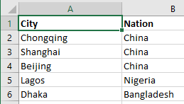
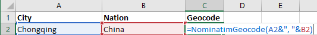
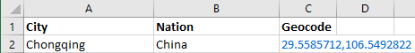
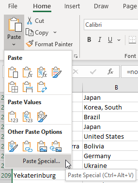
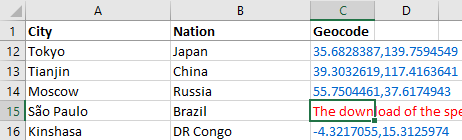
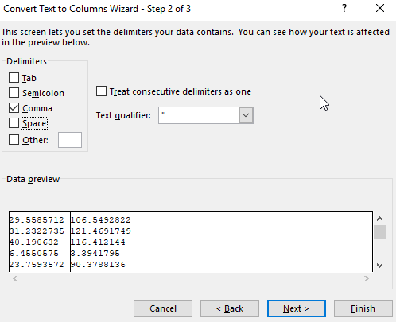
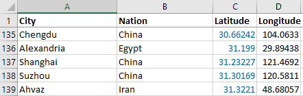

[Download Geocode.xlsm](../../raw/master/Geocode.xlsm).

This is an Excel file (with a Visual Basic macro function) that converts addresses to latitudes and longitudes (geocoding), and latitude-longitudes to addresses (reverse geocoding). This works through public geocoding APIs.

## Nominatim Geocoding functions

The Nominatim API uses OpenStreetMap, which is not as comprehensive as Google's but is free. See:
<https://nominatim.org/release-docs/develop/>

`=NominatimGeocode(address)` Converts a string address (e.g. "10 Downing Street" or "Tokyo, Japan") into a "latitude,longitude" string
`=NominatimReverseGeocode(lat, lng)` Converts a latitude and longitude into an address

## Google Geocoding functions

The Google Geocoding API is comprehensive, but requires an API key. See:
<https://developers.google.com/maps/documentation/geocoding/get-api-key>

- `=GoogleGeocode(address, api_key)` Converts a string address (e.g. "10 Downing Street" or "Tokyo, Japan") into a "latitude,longitude" string
- `=GoogleReverseGeocode(lat, lng, api_key)` Converts a latitude and longitude into an address

The usage is otherwise identical to the Nominatim functions.

# Tutorial

To get started, download and open [Geocode.xlsm](https://github.com/gramener/geocode-excel/raw/master/Geocode.xlsm).

If you see a security warning, click on "Enable Content".

In any cell, type in the formula `=NominatimGeocode("10 Downing Street, London")` in any cell. After a second, it shows the result as `51.50344025,-0.127708209585621` — which is the `<latitude>,<longitude>` combination. Here's a live example:

## Geocode an address

Visit the [list of the largest cities](https://en.wikipedia.org/wiki/List_of_largest_cities) and copy the table, along with its population into Excel.

If all the city names are in column A, you can create a new column with the formula `=NominatimGeocode(A2)` (replacing `A2` with the actual cell reference).

Here, we use `A2&", "&B2` to concatenate the city and nation. The first cell will look up “Chongqing, China”. When you press Enter, the result is:

## Geocode multiple addresses

Copy the formula into the entire column.

Automatic calculations are disabled to reduce the number of API requests. So, if you copy-paste or drag a formula, the formula is not rerun. The values are copied as-is.

Instead, select a *small* group of cells and press `Ctrl-Q` to run the RefreshSelected macro. (Each lookup takes 0.5 - 1 seconds. Select batches of 10-20 cells at a time.)

Once you finish geocoding, replace the formulas with the values. Otherwise, Excel will re-run *the entire geocoding* every time you save, open, or refresh the file. To do this, copy the geocoded cells (`Ctrl-C`) and Paste Special > Values (`Alt-H-V-S-V`).

This geocodes the selected cell range. Geocoded cells turn blue. But if there’s an error, these cells turn red.

Errors occur if the location contains special characters (e.g. the “ã” in São Paulo). In such cases, re-write the location in ASCII, i.e. without special characters (e.g. Sau Paulo.)

## Split columns

To convert this single column with `<latitude>,<longitude>` into one column each, you can use Data > [Text to Columns](https://support.office.com/en-us/article/Split-text-into-different-columns-with-the-Convert-Text-to-Columns-Wizard-30B14928-5550-41F5-97CA-7A3E9C363ED7), and split the column using comma `,` as the separator.

The result is an Excel sheet with 2 columns: Latitude and Longitude.

## Exercises

1. Geocode the [airport locations in the UK](https://en.wikipedia.org/wiki/List_of_airports_in_the_United_Kingdom_and_the_British_Crown_Dependencies)
2. Geocode the [post office locations in Singapore](https://www.singpost.com/list-of-post-offices)
