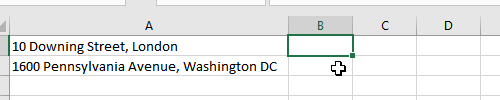

[Download Geocode.xlsm](../../raw/master/Geocode.xlsm). This is an Excel file (with a Visual Basic
macro function) that geocodes addresses and reverse geo-codes locations using the
Geocoding APIs.

## Google Geocoding functions

The Google Geocoding API is comprehensive, but requires an API key. See:
<https://developers.google.com/maps/documentation/geocoding/get-api-key>

- `=GoogleGeocode(address, api_key)` Converts a string address (e.g. "10 Downing Street" or "Tokyo, Japan") into a "latitude,longitude" string
- `=GoogleReverseGeocode(lat, lng, api_key)` Converts a latitude and longitude into an address

## Nominatim Geocoding functions

The Nominatim API uses OpenStreetMap, which is not as comprehensive as Google's but is free. See:
<https://nominatim.org/release-docs/develop/>

`=NominatimGeocode(address)` Converts a string address (e.g. "10 Downing Street" or "Tokyo, Japan") into a "latitude,longitude" string
`=NominatimReverseGeocode(lat, lng)` Converts a latitude and longitude into an address

## Usage

A typical workflow is below:

1. Open [Geocode.xlsm](Geocode.xlsm). If prompted, Enable Editing and Enable Content.
2. Fill column A with addresses
3. In cell `B2`, type `=NominatimGeocode(A2)`
4. Copy the formula in `B2` down about 30-40 (typically one page)
5. Press `Ctrl-Q` to fetch the values

The result is a `latitude,longitude` string in a single cell. Use
[Data > Text to Columns](https://support.office.com/en-us/article/Split-text-into-different-columns-with-the-Convert-Text-to-Columns-Wizard-30B14928-5550-41F5-97CA-7A3E9C363ED7)
to convert these into 2 column.

Note: *automatic calculations are disabled* to reduce the number of API requests.
If you drag a formula, select the cells and press `Ctrl-Q` to run the RefreshSelected macro.
